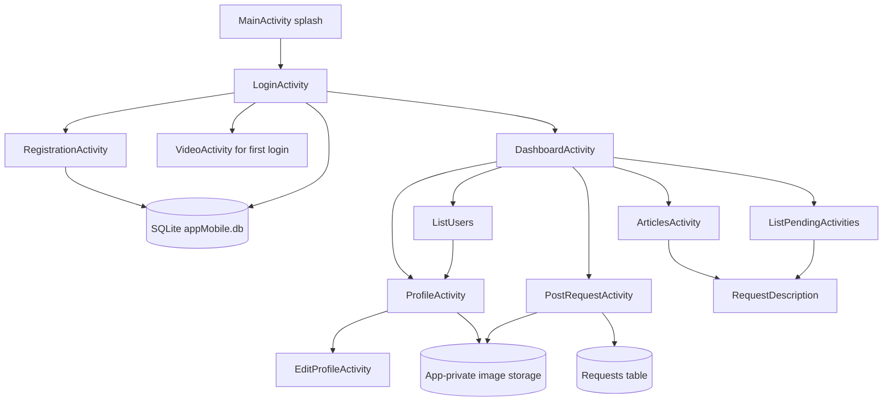

# Facture Maker

Facture Maker is a Java Android application for registering users, managing profiles, and publishing product or company requests. It provides a local request board with user and administrator workflows, including request submission, browsing, search, moderation, and profile management.

> This README describes the implementation currently present in the repository. The application is a single-module Android project and does not include a remote backend or network API.

## Table of Contents

- [Overview](#overview)
- [Features](#features)
- [Application Workflow](#application-workflow)
- [Technology Stack](#technology-stack)
- [Architecture](#architecture)
- [Project Structure](#project-structure)
- [Data Storage](#data-storage)
- [Authentication and Roles](#authentication-and-roles)
- [Permissions and Media](#permissions-and-media)
- [Installation](#installation)
- [Configuration](#configuration)
- [Running and Building](#running-and-building)
- [Testing](#testing)
- [Known Limitations](#known-limitations)
- [Future Improvements](#future-improvements)
- [Contributing](#contributing)
- [License](#license)
- [Acknowledgements](#acknowledgements)

## Overview

The app guides a user from a Palestine-themed splash screen to local registration or login. Authenticated users can maintain their profile and create requests that contain product or company information and an optional image. Published requests can be searched and paginated. Administrator workflows allow pending requests to be reviewed and accepted or rejected, and allow users to be browsed.

The application is intended as a self-contained Android prototype or locally backed request board. User accounts, requests, profile images, and request images are stored on the device in SQLite and app-private storage.

## Features

### Account and Profile Management

- Register with name, email, password, country, phone, gender, date of birth, and a security question and answer.
- Optionally select a profile photo during registration.
- Log in using locally stored email and password values.
- View and edit profile information.
- Change the profile photo and password from the profile/settings flows.
- Log out by clearing the in-memory current-user email.
- Show a bundled Gaza video to users marked as first-time users before they reach the dashboard.

### Request Board

- Create and edit product or company requests.
- Add an optional request image selected from device media.
- Browse published requests in an articles-style list.
- Open a request details screen.
- Search requests and move through paginated results.
- Display request-related user information where available.

### Administrator Workflows

- Review pending requests.
- Accept or reject requests.
- Reject a request and ban its author.
- Browse the user list.
- Open user profiles.

Administrator behavior is based on stored user flags and a hard-coded `saif3` administrator exception in the current implementation. There is no separate server-side administrator service.

### User Interface and Media

- XML layouts with Java `AppCompatActivity` screens.
- Palestine flag GIF on the splash screen.
- Bundled Gaza video shown for first-login users.
- Local drawable assets for login, signup, navigation, profile, product, company, gender, and placeholder imagery.
- Material Components and ConstraintLayout are used in the UI.

## Application Workflow

1. `MainActivity` displays the splash screen with the Palestine flag animation and a progress indicator.
2. After approximately 2.3 seconds, the app navigates to the login screen.
3. An existing user can log in with the locally stored email and password, or a new user can open registration.
4. Registration validates and stores the supplied account fields in the local SQLite database. A profile image can be selected and copied into app-private storage.
5. Users marked with `first_login = 1` are shown the bundled Gaza video before entering the dashboard.
6. The dashboard provides access to profile, settings, request creation, published requests, and administrator screens when applicable.
7. A user can create or edit a request and optionally attach an image.
8. Published requests can be searched, paginated, and opened for details.
9. Administrators can inspect pending requests, accept or reject them, ban an author when rejecting, and browse users.
10. Logout clears the in-memory current email and returns to login. Local database records remain on the device.

## Technology Stack

| Technology | Purpose |
|---|---|
| Java | Application and activity implementation |
| Android SDK | Mobile platform APIs |
| Android Gradle Plugin 4.1.2 | Android build integration |
| Gradle 6.5 | Build automation and dependency management |
| AndroidX AppCompat 1.4.1 | Compatible activity and UI support |
| Material Components 1.5.0 | Material UI components |
| ConstraintLayout 2.1.3 | Responsive XML layout constraints |
| Glide 4.12.0 | Image loading support and compiler integration |
| Android GIF Drawable 1.2.17 | Animated GIF rendering |
| SQLite | On-device relational data storage |
| JUnit 4 | Local unit-test dependency |
| AndroidX Test JUnit 1.1.3 | Instrumented test dependency |
| Espresso 3.4.0 | Instrumented UI-test dependency |

Build settings use compile SDK 31, target SDK 31, minimum SDK 17, and Java 8 source/target compatibility.

## Architecture

Facture Maker uses a simple activity-based Android architecture:

- XML resource layouts define screen structure.
- Java `AppCompatActivity` classes handle screen behavior and navigation with intents.
- `DBManager` and `RequestsManager` provide database-oriented operations.
- `DBHandler` manages SQLite database creation and upgrades.
- `User` and `Request` represent application data.
- `UserColumns` and `RequestColumns` hold database column constants and the in-memory current email.
- No fragments, ViewModels, repositories, dependency injection, reactive state layer, or remote service layer are present.



## Project Structure

```text
Hello_Android3/
├── app/
│   ├── build.gradle
│   ├── proguard-rules.pro
│   └── src/
│       ├── main/
│       │   ├── AndroidManifest.xml
│       │   ├── java/com/example/hello_android3/
│       │   │   ├── MainActivity.java
│       │   │   ├── LoginActivity.java
│       │   │   ├── RegistrationActivity.java
│       │   │   ├── DashboardActivity.java
│       │   │   ├── ProfileActivity.java
│       │   │   ├── EditProfileActivity.java
│       │   │   ├── SettingsActivity.java
│       │   │   ├── PostRequestActivity.java
│       │   │   ├── ArticlesActivity.java
│       │   │   ├── ListPendingActivities.java
│       │   │   ├── RequestDescription.java
│       │   │   ├── ListUsers.java
│       │   │   ├── UploadProfilePhoto.java
│       │   │   ├── VideoActivity.java
│       │   │   ├── DBHandler.java
│       │   │   ├── DBManager.java
│       │   │   ├── RequestsManager.java
│       │   │   ├── User.java
│       │   │   ├── Request.java
│       │   │   ├── UserColumns.java
│       │   │   └── RequestColumns.java
│       │   └── res/
│       │       ├── layout/
│       │       ├── drawable*/
│       │       ├── mipmap*/
│       │       ├── raw/
│       │       └── values/
│       ├── test/
│       └── androidTest/
├── build.gradle
├── gradle.properties
├── gradlew
├── gradlew.bat
├── gradle/wrapper/
└── settings.gradle
```

The Android package is `com.example.hello_android3`. The display name is `Facture Maker`; the Gradle root project and Java package retain their existing `Hello_Android3` naming.

## Data Storage

### SQLite

The app creates an on-device SQLite database named `appMobile.db` at database version 10. Database access is implemented by `DBHandler`, `DBManager`, and `RequestsManager`.

The user data model includes:

- Name and email
- Password
- Date of birth
- Country and phone
- Security question and answer
- Gender
- Profile-photo URI
- Administrator flag
- Banned flag
- First-login flag

Request data includes the fields represented by the `Request` and `RequestColumns` classes, including request content, image URI, status, and moderation-related information.

### Image Storage

Selected profile and request images are copied to app-private internal storage under:

```text
images/profilephoto
images/requests
```

The database stores URI or path strings that refer to these local files. There is no cloud media storage or remote file service.

## Authentication and Roles

### Regular User

A regular user can register, log in, manage their profile, create and edit requests, browse published requests, search and paginate results, and log out.

### Administrator

An administrator can inspect pending requests, accept or reject them, ban an author when rejecting a request, browse users, and open user profiles. The current code uses stored administrator flags and also contains a hard-coded `saif3` exception.

### Security Scope

Authentication is local only. The current implementation compares plaintext email and password values stored in SQLite. Passwords and security answers are not encrypted or hashed. Login state is held in the static `UserColumns.currentEmail` field, so there are no persistent sessions, tokens, secure cookies, password-reset flow, or account-recovery service.

## Permissions and Media

The manifest declares:

- `READ_EXTERNAL_STORAGE`, used for selecting media through the Android media picker.
- `WAKE_LOCK`, used by the application’s media-related behavior.

The app does not declare `INTERNET`, camera, microphone, location, contacts, or write-external-storage permissions. `MainActivity` is the launcher activity; the remaining declared activities are not exported.

## Installation

### Prerequisites

- Android Studio with Android SDK platform 31 installed.
- Android SDK build tools 30.0.3 installed, matching `app/build.gradle`.
- A JDK compatible with Gradle 6.5 and Android Gradle Plugin 4.1.2. The repository is configured for Java 8 source compatibility; Java 17 is not compatible with this legacy Gradle setup without upgrading the build toolchain.
- An Android device or emulator running API level 17 or later.

### Setup

1. Clone or open the repository.
2. Open the repository root in Android Studio.
3. Allow Android Studio to use the Gradle wrapper.
4. Install the SDK platform and build tools versions required above.
5. Configure the local Android SDK path through Android Studio or `local.properties`. The existing `local.properties` is machine-specific and should not be committed or copied between machines.

No external database, API key, `.env` file, server, or Firebase project is required by the current source.

## Configuration

The main build configuration is in `app/build.gradle`. The project uses:

- `applicationId`: `com.example.hello_android3`
- Display label: `Facture Maker`
- `compileSdkVersion`: 31
- `targetSdkVersion`: 31
- `minSdkVersion`: 17
- `versionCode`: 1
- `versionName`: `1.0`

The repository uses `google()` and `jcenter()` repositories. `jcenter()` is retired and may make dependency resolution unreliable on a modern setup; updating the repository and Android Gradle Plugin versions is a maintenance task outside the current implementation.

## Running and Building

From the repository root on Windows:

```bat
gradlew.bat assembleDebug
gradlew.bat installDebug
```

On macOS or Linux:

```bash
./gradlew assembleDebug
./gradlew installDebug
```

The debug APK is generated under `app/build/outputs/apk/debug/` after a successful build. Run the app from Android Studio on a connected device or emulator.

For this repository, a build with the currently installed Java 17 environment fails during Gradle settings compilation because Gradle 6.5 cannot load Java 17 class files. Use a compatible JDK or upgrade the legacy Gradle/Android Gradle Plugin toolchain as a separate modernization task.

## Testing

The repository contains the default template tests:

- `app/src/test/java/com/example/hello_android3/ExampleUnitTest.java` checks a basic arithmetic assertion.
- `app/src/androidTest/java/com/example/hello_android3/ExampleInstrumentedTest.java` checks the application context package name.

Run them from the repository root:

```bat
gradlew.bat test
gradlew.bat connectedAndroidTest
```

There are currently no automated tests covering registration, login, database schema behavior, profile editing, request creation, moderation, image selection, or navigation.

## Known Limitations

The following limitations are visible in the current source:

- Authentication stores and compares passwords in plaintext locally.
- There is no remote backend, synchronization, API, persistent session, password recovery, or account recovery.
- The users table creation does not define the `gender` column even though registration and user queries use it.
- The requests table creation does not define all status and moderation columns used by request insertion, filtering, and moderation. Fresh database installations may therefore fail during registration or request workflows.
- The database upgrade logic only adds `first_login` and does not repair the other missing schema columns.
- `RequestDescription` can attempt to use an uninitialized posting-time view in a non-administrator path.
- Some list screens assume non-null data and related users.
- Search reloads data from SQLite on each change and does not clearly reset the current page.
- Several layouts use fixed pixel dimensions, which can affect different screen sizes.
- There is no documented seed process or default administrator setup beyond the hard-coded `saif3` behavior.
- The login layout references forgot-password and create-account handlers that are not implemented as declared XML callbacks; account creation is wired programmatically.
- Some interface labels imply change-log functionality, but no complete change-log implementation was found.
- The forum icon appears in several layouts without a corresponding click behavior.

## Future Improvements

These are potential improvements, not features currently provided by the application:

- Add a backend API and secure server-side authentication.
- Hash passwords and security answers with a modern password-hashing algorithm.
- Replace the hard-coded administrator exception with managed roles and permissions.
- Repair and migrate the SQLite schema, then add database migration tests.
- Add feature and UI tests for authentication, requests, moderation, and image handling.
- Replace retired `jcenter()` usage and modernize the Gradle and Android Gradle Plugin versions.
- Move toward a lifecycle-aware architecture with ViewModels and repositories.
- Improve responsive layouts and accessibility across phones and tablets.
- Implement password recovery, notifications, and reliable session handling.
- Add project screenshots and a product demonstration when they become available.

## Contributing

1. Fork the repository.
2. Create a feature branch:

   ```bash
   git checkout -b feature/your-change
   ```

3. Make focused changes and add tests where possible.
4. Run the relevant Gradle checks.
5. Commit your work:

   ```bash
   git add .
   git commit -m "Describe the change"
   ```

6. Push the branch:

   ```bash
   git push origin feature/your-change
   ```

7. Open a pull request with a clear summary and verification notes.

## License

No license file or license declaration was found in the repository. This project should not be redistributed under a specific open-source license unless the owner adds one.

## Acknowledgements

The application uses the following third-party libraries:

- AndroidX AppCompat
- Material Components for Android
- ConstraintLayout
- Glide
- Android GIF Drawable
- JUnit
- AndroidX Test JUnit
- Espresso

The repository also includes a Palestine flag GIF and a Gaza video as application assets. Their licensing and attribution details are not documented in the source repository.
